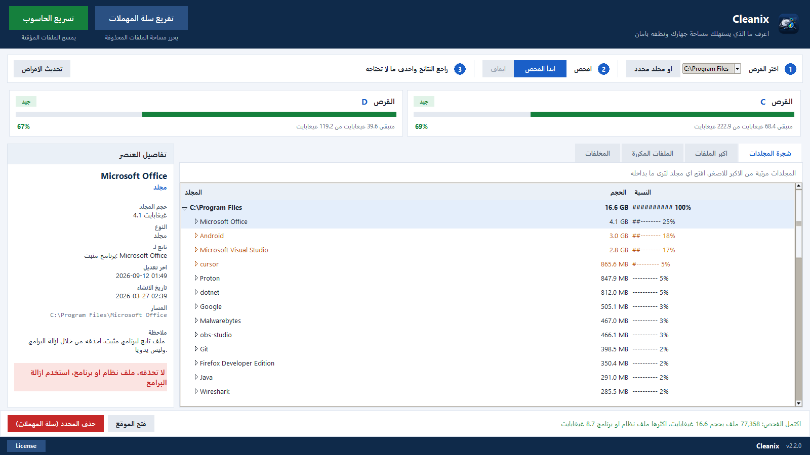

# Cleanix

برنامج صغير لويندوز يوريك شنو ماكل مساحة القرص عندك، ويخليك تنظفها بدون ما تخاف تحذف شي مهم.



## ليش سويته

كل مرة يمتلي القرص C كنت افتح المجلدات وحدة وحدة حتى الكى المشكلة، وما اعرف هذا الملف اكدر احذفه لو يخرب برنامج. فكتبت اداة تعرض المجلدات مرتبة من الاكبر للاصغر، وتكلك عن كل ملف شنو هو، تابع لاي برنامج، وهل حذفه امن.

## شنو يسوي

- يفحص اي قرص او مجلد ويرتب المجلدات حسب الحجم
- يعرض اكبر الملفات وتكدر تفلترها حسب النوع (فيديو، مستندات، برامج...)
- لما تختار ملف يطلعلك نوعه والبرنامج التابع له والناشر، ولون يوضح: امن للحذف، راجعه، لا تحذفه
- يلكه الملفات المكررة بمقارنة محتواها، مو بس الاسم
- زر "تسريع الحاسوب" يمسح ملفات `%TEMP%` ويفرغ سلة المهملات بتاكيد واحد
- تبويب المخلفات ينظف كاش المتصفحات وتفريغات الاعطال ويبقي المجلدات نفسها
- الحذف العادي يروح لسلة المهملات، ومجلدات النظام ومجلداتك الاساسية ما تنحذف
- الواجهة كلها عربي من اليمين لليسار

## التحميل

من صفحة [Releases](https://github.com/dvlinuxx-max/Cleanix/releases/latest):

- `Cleanix-Setup-2.2.0.exe` ملف تثبيت
- `Cleanix-2.2.0-portable.exe` نسخة تشتغل مباشرة بدون تثبيت

الملفات مو موقعة رقميا لحد الان، فممكن ويندوز يطلع تنبيه SmartScreen. اضغط More info بعدين Run anyway.

## التشغيل من الكود

يحتاج ويندوز وبايثون 3.9 او احدث (ويا tkinter).

```
pip install -r requirements.txt
python Cleanix.py
```

او شغل `Run.bat`.

## البناء

```
cd v2
pyinstaller --noconfirm --clean Cleanix.spec
ISCC.exe installer.iss
```

الـ exe يطلع بـ `v2/dist` وملف التثبيت بـ `v2/Output`. حزمة متجر مايكروسوفت تنبني بـ `v2/msix/build_msix.py`.

## الرخصة

MIT، شوف ملف [LICENSE](LICENSE).

Mohammed Abd Alrahman - [mohmadev.com](https://mohmadev.com/)
